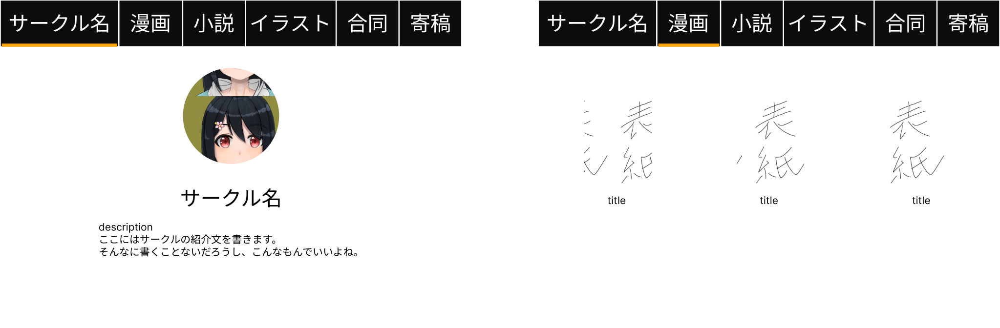
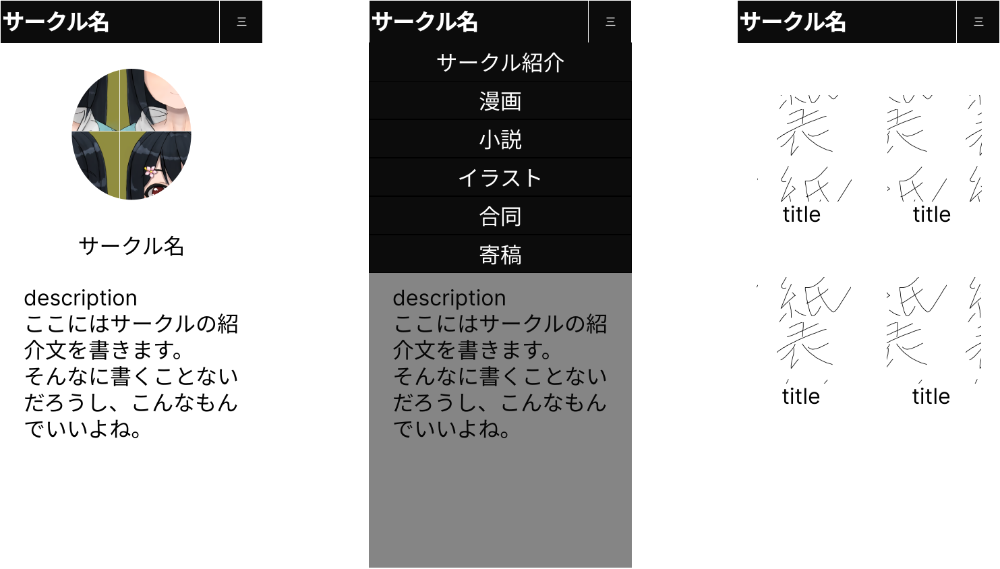

# TheSeedHomePage

## 概要

同人サークルを対象とした、誰でも簡単に運用できるホームページのひな型

## 想定される運用
GitHubを通して配布し、Github.ioで公開する。
コンテンツの追加、変更、削除はGithubのリモートリポジトリ上で直接行う。

運用に関わる操作

- Githubアカウント作成
- リポジトリのFork
- Github.ioの公開設定
- コンテンツの追加、変更、削除

の方法をまとめたドキュメントを作成し、配布するリポジトリ上に配置する。

## 機能

サークルを紹介するページと頒布物を紹介するページを設ける。
また同人サークルの頒布物の種類に応じて、紹介ページを設ける。

- マンガ
- イラスト
- 小説
- グッズ
- CD
- 合同
- 寄稿

項目の品物がない場合は非表示にする。

品物は表紙などのイメージとタイトルのデータを必ず持つ。
イメージをクリックすると、詳細なデータが表示されるようにする。
詳細に電子版や委託販売などへのリンクを貼れるようにする。

## UI(想定)

Figmaでデザインを作成した。
[UI案](https://www.figma.com/file/kyOAuPHbPRWU2PyahMGBbV/TheSeedHomePage?type=design&node-id=0%3A1&mode=design&t=LRsZoKQBbZlj4SvY-1)

### PC版

### スマホ版

